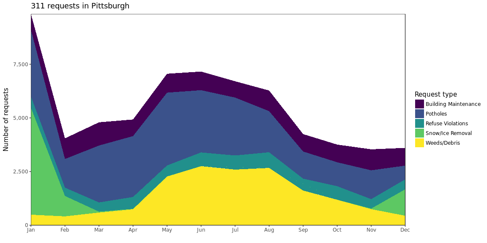
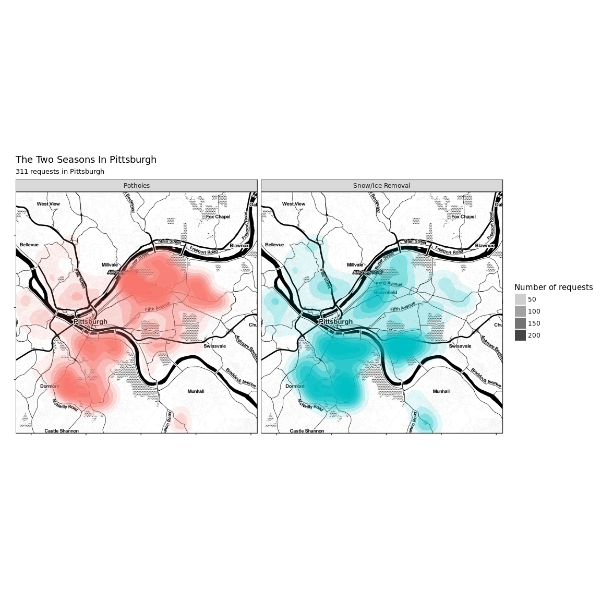

311 requests in Pittsburgh
==========================

``` r
source("scripts/load_data.R")

library(ggmap)
library(viridis)
library(scales)
library(knitr)
library(kableExtra)

theme_set(theme_bw(base_family = 18))
```

``` r
df %>% 
  count(request_type, sort = TRUE) %>% 
  top_n(5) %>% 
  ungroup() -> df_top_requests
```

``` r
df %>% 
  semi_join(df_top_requests) %>% 
  count(request_type, month) %>% 
  ggplot(aes(month, n, group = request_type, fill = request_type)) +
  geom_area() +
  scale_fill_viridis("Request type", discrete = TRUE, option = "D") +
  scale_y_continuous(expand = c(0, 0),
                     labels = comma) +
  scale_x_discrete(expand = c(0, 0)) +
  labs(title = "Top 5 types of 311 requests in Pittsburgh",
       x = "",
       y = "Number of requests") +
  theme_bw(base_family = 18) +
  theme(panel.grid = element_blank())
```



``` r
df %>% 
  select(request_type, x, y) %>% 
  filter(!is.na(x), !is.na(y),
         request_type %in% c("Potholes", "Snow/Ice Removal")) -> df_map

city_map <-  get_map("North Oakland, Pittsburgh, PA", 
                     zoom = 12,
                     maptype = "toner", 
                     source = "stamen")

city_map <- ggmap(city_map)

#Put the data on the map
city_map +
  stat_density_2d(data = df_map, #Using a 2d contour
                  aes(x, #longitude
                      y, #latitude
                      fill = request_type, #Use the count of arrests as the fill
                      alpha = ..level..), #Use alpha so you can see the map under the data
                  geom = "polygon") + #We want the contour in a polygon
  facet_wrap(~request_type) +
  scale_alpha_continuous(range = c(.1, 1)) +
  guides(fill = FALSE,
         alpha = guide_legend("Number of requests")) +
  labs(title = "The Two Seasons In Pittsburgh",
       subtitle = "311 requests in Pittsburgh",
       x = "",
       y = "") +
  theme_bw(base_family = 18) +
  theme(axis.text = element_blank())
```


